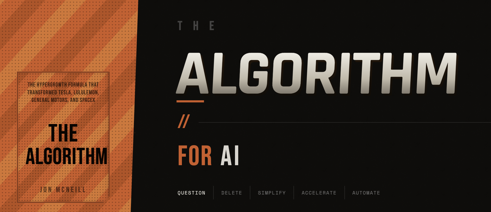

<p align="center">
  
</p>

# The Algorithm

Based on [*The Algorithm*](https://www.dvx.ventures/the-algorithm) by Jon McNeill. Jon was President of Tesla and later COO at Lyft. He'd already founded and sold six startups when he joined Musk at Tesla, where he watched a five-step framework take the company from a production crisis that nearly killed it to $2B-to-$20B revenue growth in 30 months.

Elon called it The Algorithm. Jon and his teams applied it obsessively — on the factory floor, in software, in organizational design — and have since used it at every company they've touched. The book details how it worked at Tesla and SpaceX, and how it's been applied at Lululemon, GM, DVx Ventures and companies of every size across industries.

The power is in the sequence. Almost everyone starts at step 3 (optimize) or step 5 (automate). They pour effort into making bad processes faster or automating things that shouldn't exist. The Algorithm forces you to question first, delete second, simplify third. By the time you reach automation, you're automating something worth automating.

This repo turns that framework into an AI skill you can use right now — AI does the heavy analytical work, you bring the context and judgment.

## The Five Steps

Five steps. In order. Every time.

1. **Question every requirement.** Each should come with a name attached. If you can't say who required it and why, it's suspect.
2. **Delete every possible step.** If you're not adding back 10% of what you deleted, you're not deleting enough.
3. **Simplify and optimize.** But not before steps 1 and 2. The most common mistake smart people make is optimizing something that should not exist.
4. **Accelerate cycle time.** But not before step 3. Don't speed up a bad process.
5. **Automate.** But not before step 4. Don't automate waste.

## Use with Any AI Tool

Works with **Claude**, **ChatGPT**, **Gemini**, or any AI tool that accepts custom instructions.

**[Try it now on ChatGPT](https://chatgpt.com/g/g-69e003e0e2c881918512852dc65e04bd-the-algorithm)** — a ready-made GPT, no setup required.

Or set it up in your own tool:

1. Download [`dist/the-algorithm.md`](dist/the-algorithm.md)
2. Upload it or paste it into your AI tool
3. Give it real documents, processes, and data to work on

**[Setup guide and website](https://jordanjoecooper.github.io/the-algorithm)** — step-by-step instructions for each platform. Or see the [text guide](GUIDE.md).

## Getting the Best Results

The Algorithm works best when you give it **real things to chew on** — not abstract questions, but actual documents, processes, plans, and data from your work. The more concrete the input, the more useful the output.

### What to feed it

- **Documents:** Product specs, PRDs, project plans, strategy decks, SOPs
- **Process maps:** Your actual steps from start to finish — hiring pipelines, deploy workflows, sales cycles, support escalation paths
- **Feature lists:** Your real backlog, roadmap, or v2 scope — not a summary, the actual list
- **Messages and conversations:** Slack threads, email chains, meeting notes where decisions were made (or avoided)
- **Diagrams and architecture:** System diagrams, org charts, workflow diagrams, database schemas
- **Financial data:** Pricing structures, cost breakdowns, budget allocations
- **Code:** Actual repos, modules, config files — not descriptions of code

The more real context you provide, the better the analysis. A vague "optimize our onboarding" gets a generic answer. Pasting your actual onboarding flow with every step, email, wait time, and handoff gets a specific, actionable breakdown.

### Examples

**Score a real process:**
```
Here's our customer onboarding flow:
1. Sales closes deal (day 0)
2. Sales emails CS team with deal details (day 0-2, depends when they get to it)
3. CS creates account in admin panel (day 2-3)
4. CS sends welcome email with login credentials (day 3)
5. Customer schedules kickoff call (day 3-7, they pick a time)
6. Kickoff call — walk through the product (day 7-10)
7. CS sends follow-up with action items (day 10-11)
8. Customer completes setup tasks (day 11-14, usually stalls here)
9. CS checks in to see if they need help (day 14)
10. Customer reaches "first value" (day 14-21)

We're losing 30% of customers before step 6. Score this against The Algorithm.
```

**Question requirements from a real document:**
```
Here's our PRD for the new billing system. Challenge every requirement in it:
[paste the actual PRD]
```

**Delete from a real feature list:**
```
Here's our v2 roadmap — 23 features across 4 workstreams. What can we cut?
[paste the actual feature list with descriptions]
```

**Simplify a real pricing structure:**
```
Our pricing has 4 tiers, 3 add-ons, annual/monthly billing, and custom enterprise deals.
[paste pricing tiers, rules, add-ons, discount logic, enterprise exceptions]
Simplify it.
```

**Accelerate a real hiring pipeline:**
```
Our engineering hiring process:
- Recruiter screen (30 min, scheduled within 3 days of application)
- Hiring manager screen (45 min, scheduled within 5 days)
- Take-home assignment (sent after HM screen, 7-day deadline, most take 5 days)
- Technical panel (3 engineers, 2 hours, scheduling takes 5-7 days)
- Culture fit interview (VP Eng, 45 min, usually 2-3 days after panel)
- Reference checks (3 references, takes 3-5 days)
- Offer review committee (meets Thursdays)
- Offer letter sent (1-2 days after committee)

Total: 5-7 weeks. We're losing candidates to faster companies. How do we accelerate this?
```

**Automate real manual work:**
```
Every Monday our ops team does this:
1. Pull sales data from Salesforce (export CSV)
2. Pull usage data from our analytics dashboard (export CSV)
3. Pull support tickets from Zendesk (export CSV)
4. Open last week's Google Sheet template, paste all three CSVs
5. Manually reconcile customer names across all three sources
6. Build 4 charts in the sheet
7. Write a 3-paragraph summary of trends
8. Email it to the exec team
9. Post a shorter version in #leadership Slack channel

Takes 3-4 hours every Monday morning. What should we automate?
```

### Tips for better results

- **Paste the real thing**, not a description of it. "Our onboarding has too many steps" is less useful than pasting the actual 12-step flow.
- **Include the messy details.** The exceptions, the workarounds, the "we know this is bad but..." — that's where the biggest wins hide.
- **Name the people.** "Marketing requires this" is weaker than "Sarah in Marketing requested this in Q2 because of the rebrand." Requirements without names are the first to challenge.
- **Include timing.** How long does each step take? Where does work sit idle? The wait times between steps are usually bigger than the steps themselves.

### The Cardinal Rule

The steps are sequential for a reason. Never optimize before deleting. Never automate before simplifying. The discipline IS the method.

If you try to skip ahead, the AI will push back — politely, but firmly. You can override it. You're the operator. But the warning exists because the most common failure mode is jumping to solutions before understanding the problem.

## Claude Code

If you use [Claude Code](https://docs.anthropic.com/en/docs/claude-code), you can install The Algorithm as native slash commands for a more integrated experience.

### Install

```bash
git clone https://github.com/jordanjoecooper/the-algorithm.git ~/.claude/skills/thealgorithm
cd ~/.claude/skills/thealgorithm && ./install.sh
```

No dependencies. No build step. The install script creates symlinks so Claude Code discovers each skill.

To update: `cd ~/.claude/skills/thealgorithm && git pull && ./install.sh`

### Skills

| Command | Step | What it does |
|---------|------|-------------|
| `/algorithm` | All | Full 5-step run. Walks through every step in order with structured output at each stage. |
| `/question` | 1 | Deep dive on requirements. Surfaces every assumption and challenges each one. |
| `/delete` | 2 | Find everything to cut. Maps every component and argues for removing each one. |
| `/simplify` | 3 | Reduce complexity. Makes what remains as simple as possible. |
| `/accelerate` | 4 | Speed things up. Finds every delay, bottleneck, and batch. |
| `/automate` | 5 | Identify automation. Assesses what should be automated, what should stay manual. |
| `/score` | — | Quick diagnostic. Scores against all 5 steps, identifies the weakest link. |

## Attribution

The five-step Algorithm framework is from the book [*The Algorithm*](https://www.dvx.ventures/the-algorithm) by Jon McNeill. All intellectual property rights in the book, its contents, and the underlying framework belong to the author and/or publisher.

This repository is an **independent, unofficial implementation** that encodes the publicly described concepts as AI prompts. It is not affiliated with, endorsed by, or sponsored by Jon McNeill, DVx Ventures, or the publisher of the book. If you find the framework useful, [buy the book](https://www.dvx.ventures/the-algorithm).

## Author

Made by [jordanjoecooper](https://github.com/jordanjoecooper).

## License

The code in this repository (prompt files, scripts, HTML) is released under the [MIT License](LICENSE). This license applies only to the software implementation — it does not grant any rights to the underlying intellectual property of *The Algorithm* by Jon McNeill.
